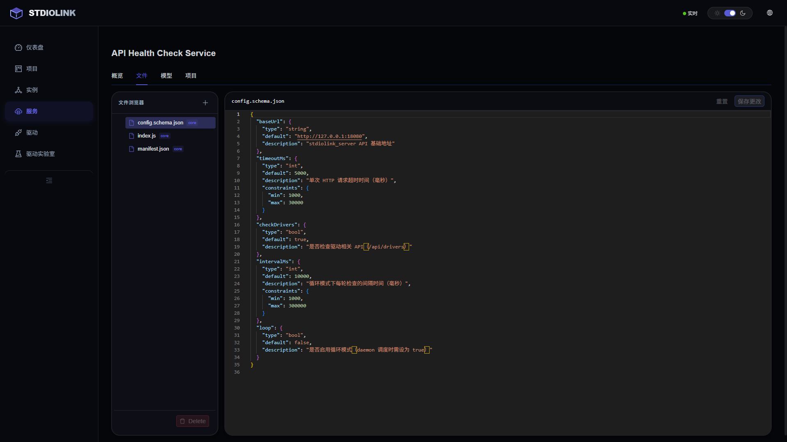
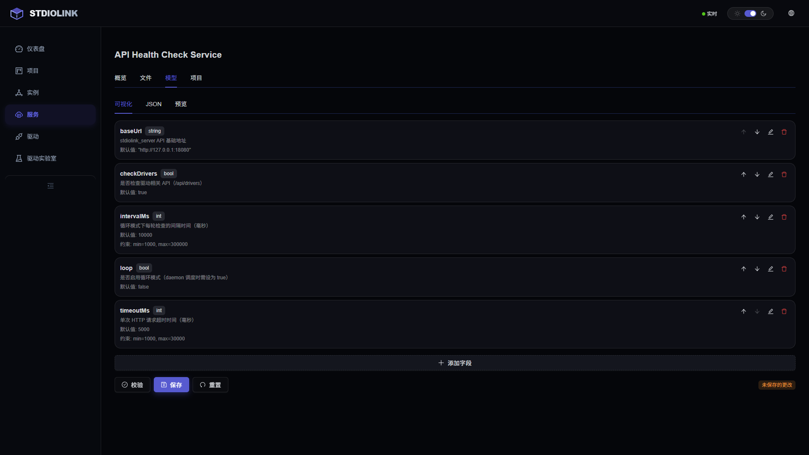
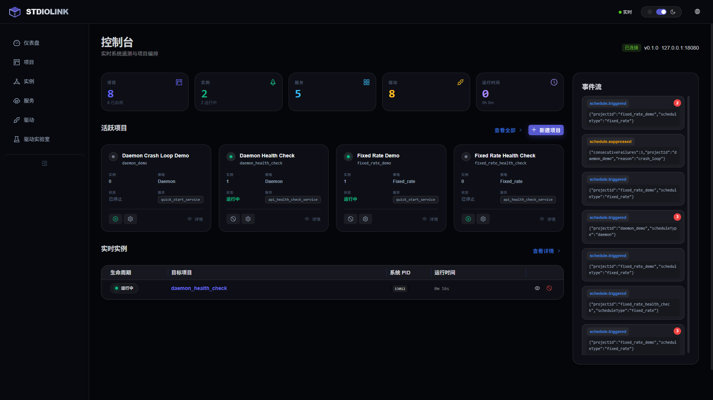
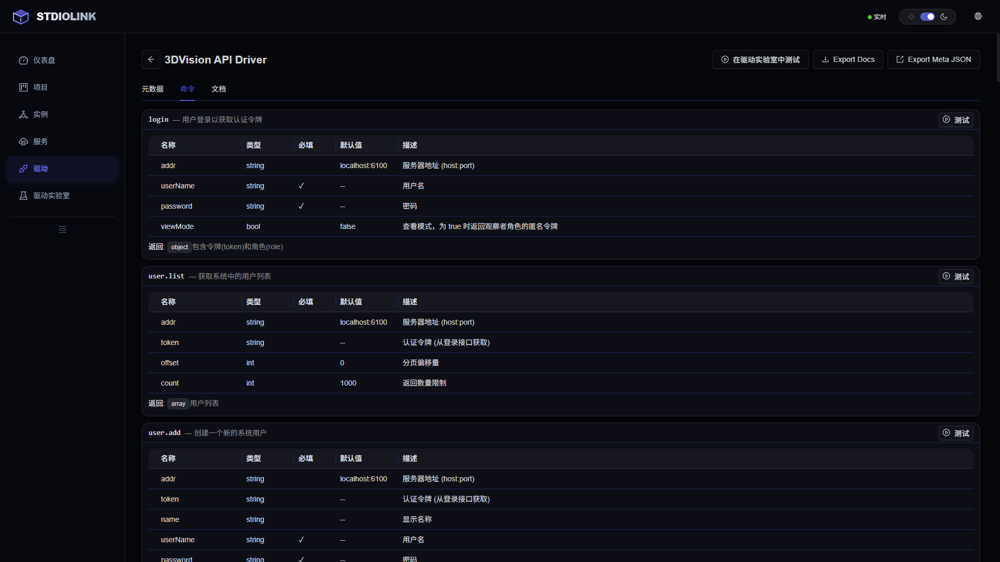
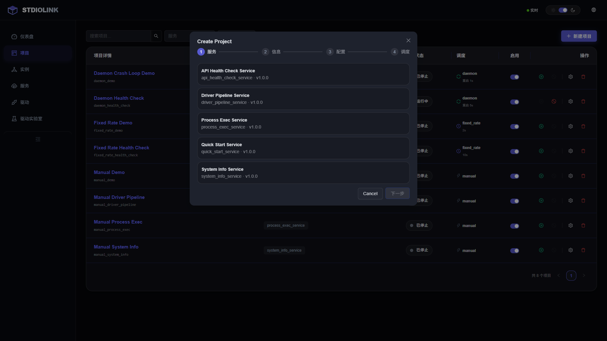

<p align="right">
  <a href="README.md">English</a> | <a href="README_zh.md">中文</a>
</p>

<p align="center">
  <h1 align="center">stdiolink</h1>
  <p align="center">
    A cross-platform IPC framework that turns any executable into a manageable, orchestratable service — using nothing but stdin/stdout and JSON.
  </p>
  <p align="center">
    
  </p>
  <p align="center">
    <a href="#quick-start">Quick Start</a> &middot;
    <a href="#architecture">Architecture</a> &middot;
    <a href="#features">Features</a> &middot;
    <a href="doc/manual/README.md">Documentation</a> &middot;
    <a href="doc/http_api.md">API Reference</a>
  </p>
</p>

---

## Why stdiolink?

Most IPC frameworks force you into a specific transport (gRPC, REST, message queues) and a specific language ecosystem. **stdiolink** takes a radically simpler approach:

- **stdin/stdout is the universal interface.** Any language, any runtime, any platform — if it can read and write lines, it can be a stdiolink driver.
- **JSONL is the protocol.** One JSON object per line. Human-readable, debuggable with `echo`, no schema compilation step.
- **Self-describing drivers.** Each driver exports its own metadata — commands, parameter schemas, validation rules — enabling automatic UI generation, documentation, and configuration validation with zero extra code.

This means you can wrap a Python script, a Rust binary, a Node.js tool, or a legacy C++ application into a fully managed service with health monitoring, scheduling, and a web dashboard — without modifying a single line of the original program's core logic.

## Key Advantages

| | Traditional IPC | stdiolink |
|---|---|---|
| **Transport** | TCP/gRPC/WebSocket setup | stdin/stdout (zero config) |
| **Language** | SDK per language | Any language that does I/O |
| **Discovery** | Service registry needed | Auto-scan + metadata export |
| **Debugging** | Wireshark / custom tools | `echo '{"cmd":"ping"}' \| ./driver` |
| **UI** | Build from scratch | Auto-generated from metadata |
| **Orchestration** | Kubernetes / systemd | Built-in scheduler + process guard |

## Quick Start

### Build from Source

**Prerequisites:** Qt 6.6+, CMake 3.20+, vcpkg, C++17 compiler

```bash
# Windows
build.bat Release

# macOS / Linux
./build.sh Release

# Run tests
./build/bin/stdiolink_tests
```

### Your First Driver (JavaScript)

```javascript
import { openDriver } from "stdiolink";

const calc = await openDriver("./stdio.drv.calculator");

// Proxy syntax — call remote commands like local functions
const result = await calc.add({ a: 10, b: 20 });
console.log(result);  // { result: 30 }

calc.$close();
```

### Parallel Drivers

```javascript
import { openDriver } from "stdiolink";

const [drvA, drvB] = await Promise.all([
    openDriver("./stdio.drv.calculator"),
    openDriver("./stdio.drv.calculator"),
]);

const [a, b] = await Promise.all([
    drvA.add({ a: 10, b: 20 }),
    drvB.multiply({ a: 3, b: 4 }),
]);

console.log(a, b);  // { result: 30 } { result: 12 }
drvA.$close();
drvB.$close();
```

### The JSONL Protocol

Communication is dead simple — one JSON per line over stdin/stdout:

```
→  {"cmd":"add","data":{"a":10,"b":20}}
←  {"status":"done","code":0,"data":{"result":30}}
```

Four message semantics:
- `done` — final success result
- `event` — intermediate streaming event
- `error` — error response
- `meta.describe` — metadata export

## Architecture

```
┌─────────────────────────────────────────────────────────┐
│  stdiolink_server          (Control Plane)              │
│  REST API · SSE · WebSocket · Scheduler · Process Guard │
├─────────────────────────────────────────────────────────┤
│  stdiolink_service         (JS Runtime)                 │
│  QuickJS Engine · ES Modules · C++ Bindings             │
├─────────────────────────────────────────────────────────┤
│  stdiolink                 (Core Library)               │
│  JSONL Protocol · Driver/Host · Metadata · Validation   │
└─────────────────────────────────────────────────────────┘
         │                          │
    ┌────┴────┐              ┌──────┴──────┐
    │ Driver  │  stdin/stdout │   Driver    │
    │ (C++)   │◄────────────►│ (Any Lang)  │
    └─────────┘              └─────────────┘
```

### Three-Tier Service Model

```
Service (template)  →  Project (configuration)  →  Instance (running process)
```

- **Service**: A reusable driver or JS script template discovered by auto-scanning
- **Project**: A configured deployment of a service with specific parameters
- **Instance**: A running process managed with lifecycle control, health checks, and log capture

## Features

### Self-Describing Metadata

Drivers declare their capabilities through a rich metadata system:

```cpp
DriverMetaBuilder()
    .id("stdio.drv.modbus_tcp")
    .name("Modbus TCP Driver")
    .version("1.0.0")
    .addCommand(CommandBuilder("read_registers")
        .description("Read holding registers")
        .addParam(FieldBuilder("host").type(FieldType::String).required())
        .addParam(FieldBuilder("port").type(FieldType::Int).defaultValue(502))
        .addParam(FieldBuilder("count").type(FieldType::Int).range(1, 125)))
    .build();
```

This metadata enables:
- Automatic parameter validation with type checking and range constraints
- UI form generation (the WebUI renders interactive forms from metadata alone)
- OpenAPI-compatible documentation export
- Configuration schema enforcement



### Built-in JavaScript Runtime

Write services in JavaScript with full access to system capabilities through C++ bindings:

```javascript
import { openDriver, waitAny } from "stdiolink";
import { writeJson } from "stdiolink/fs";
import { createLogger } from "stdiolink/log";

const logger = createLogger({ service: "pipeline" });
const drv = await openDriver("./stdio.drv.sensor");

const task = drv.$rawRequest("read", { channel: 1 });
const result = await waitAny([task], 5000);

writeJson("./output/report.json", result.msg.data);
logger.info("done", { status: result.msg.status });
```

Available JS modules: `stdiolink`, `stdiolink/fs`, `stdiolink/path`, `stdiolink/log`, `stdiolink/time`, `stdiolink/constants`

### Server Management & REST API

Full HTTP API for programmatic control:

```bash
# List all services
curl http://localhost:6200/api/services

# Create a project from a service
curl -X POST http://localhost:6200/api/projects \
  -d '{"serviceId":"modbus_tcp","name":"Factory Floor","config":{...}}'

# Start an instance
curl -X POST http://localhost:6200/api/projects/factory-floor/start

# Real-time events via SSE
curl http://localhost:6200/api/events
```

### Scheduling Engine

Three built-in scheduling strategies:
- **Manual** — start/stop on demand
- **Interval** — periodic execution with configurable intervals
- **Cron** — cron-expression based scheduling

### Modern WebUI

A production-ready management dashboard built with React 18 + TypeScript:



- **Mission Control Dashboard** — real-time overview of all services, projects, and instances
- **DriverLab** — interactive debugging console with WebSocket proxy to live driver processes
- **Schema Editor** — visual configuration editor powered by Monaco, auto-generated from driver metadata
- **9 Languages** — i18n support via i18next
- **Glassmorphism Design** — premium "Style 06" visual language with Bento Grid layout





### Process Guard

Production-grade process management:
- Automatic crash detection and configurable restart policies
- Process health monitoring with heartbeat checks
- Race condition safeguards for async server operations
- Graceful shutdown with cleanup guarantees


## Project Structure

```
stdiolink/
├── src/
│   ├── stdiolink/            # Core library — protocol, metadata, Driver/Host
│   ├── stdiolink_service/    # JS runtime — QuickJS engine + C++ bindings
│   ├── stdiolink_server/     # Control plane — REST API, SSE, scheduler
│   │   ├── manager/          #   Project, Instance, Schedule managers
│   │   ├── http/             #   HTTP routes, SSE, WebSocket proxy
│   │   └── scanner/          #   Auto-discovery for services & drivers
│   ├── webui/                # React frontend (Vite + Ant Design)
│   └── drivers/              # Example drivers (ModbusTCP, ModbusRTU, 3DVision)
├── examples/                 # JavaScript usage examples
├── doc/
│   ├── manual/               # Complete user manual
│   └── http_api.md           # REST API reference
├── tools/                    # Build & release scripts
├── build.bat / build.sh      # Platform build scripts
└── CMakeLists.txt
```

## Tech Stack

| Layer | Technology |
|---|---|
| Core Library | C++17, Qt 6.6+ (Core, Network, WebSockets, HttpServer) |
| JS Runtime | QuickJS-NG, ES Modules |
| Build | CMake 3.20+, vcpkg |
| Testing | Google Test, Vitest, Playwright |
| Frontend | React 18, TypeScript, Vite, Ant Design, Monaco Editor |
| State | Zustand |
| Visualization | Recharts |

## Release Packaging

```powershell
# Windows
.\tools\publish_release.ps1 --name stdiolink_v1.0

# macOS / Linux
./tools/publish_release.sh --name stdiolink_v1.0
```

The release package includes:
- Server and service binaries
- Auto-discovered drivers in `data_root/drivers/`
- Pre-seeded demo services and projects
- Bundled WebUI
- Startup scripts (`start.bat` / `start.sh`)

## Documentation

- [User Manual](doc/manual/README.md) — comprehensive guide covering protocol, Driver/Host development, JS runtime, and server management
- [HTTP API Reference](doc/http_api.md) — complete REST API documentation
- [Architecture Overview](doc/manual/03-architecture.md) — system design and data flow

## Contributing

Contributions are welcome! Please follow these conventions:

- **Commits**: [Conventional Commits](https://www.conventionalcommits.org/) (`feat:`, `fix:`, `docs:`, etc.)
- **Naming**: Classes `CamelCase`, methods `camelBack`, members `m_` prefix
- **Qt-first**: Use `QFile` for I/O, `QJsonObject` for JSON, `QTextStream` for pipe reads
- **No blocking I/O**: Windows pipe reads must use `QTextStream::readLine()`

## License

See [LICENSE](LICENSE) for details.
